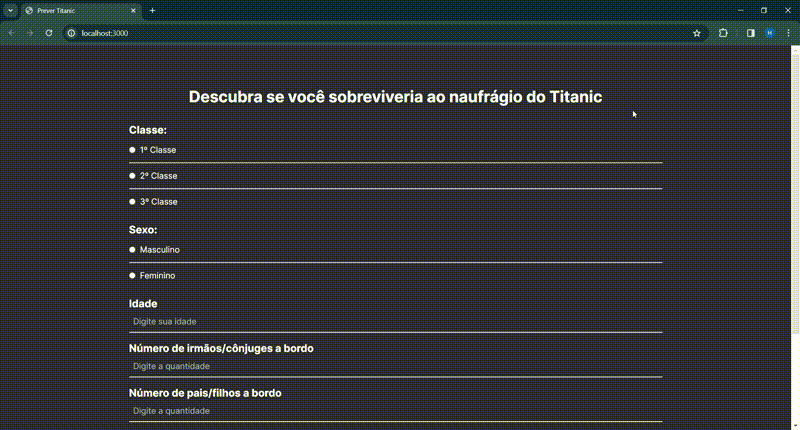

# Titanic Survival Predictor

Este projeto é uma aplicação web que utiliza um modelo de Machine Learning para prever se uma pessoa sobreviveria ou não ao desastre do Titanic. O objetivo principal é demonstrar o uso de APIs em Python, Machine Learning com Scikit-learn e desenvolvimento de interfaces web com Next.js e React.

## Instalação e Execução

Para executar o projeto localmente, siga estas etapas:

1. Clone este repositório para sua máquina local.
2. No terminal, navegue até a pasta `backend` e execute o comando `python app.py` para iniciar a API Flask.
3. Abra outro terminal, navegue até a pasta `frontend` e execute `npm install` seguido de `npm run dev` para iniciar o servidor de desenvolvimento do Next.js.

Certifique-se de que todas as dependências estão instaladas corretamente antes de iniciar o projeto.

## Uso

Após iniciar os servidores Flask e Next.js, você pode acessar a aplicação em seu navegador. Preencha o formulário com informações pessoais e clique em "Enviar" para ver a previsão de sobrevivência no desastre do Titanic.

## Modelo de Machine Learning

O modelo de Machine Learning foi treinado com dados históricos de sobreviventes e mortos no desastre do Titanic. O modelo está armazenado em um arquivo `model_svm.joblib` na pasta `backend/data`.

## Contribuição

Contribuições são bem-vindas! Se você quiser contribuir com o projeto, siga estas etapas:

1. Fork este repositório.
2. Crie uma nova branch para sua funcionalidade (`git checkout -b feature/nova-funcionalidade`).
3. Faça suas alterações e commit (`git commit -am 'Adiciona nova funcionalidade'`).
4. Push para a branch (`git push origin feature/nova-funcionalidade`).
5. Crie um novo Pull Request.

## Problemas e Sugestões

Se você encontrar algum problema ou tiver alguma sugestão para o projeto, por favor, abra uma issue neste repositório.

## Licença

Este projeto está licenciado sob a [Licença MIT](LICENSE).

## Demonstração

Assista a este vídeo para ver o projeto em ação:

]

## Tecnologias Utilizadas

- Python
- TypeScript
- Flask
- Scikit-learn
- Next.js
- React
- Tailwind CSS
